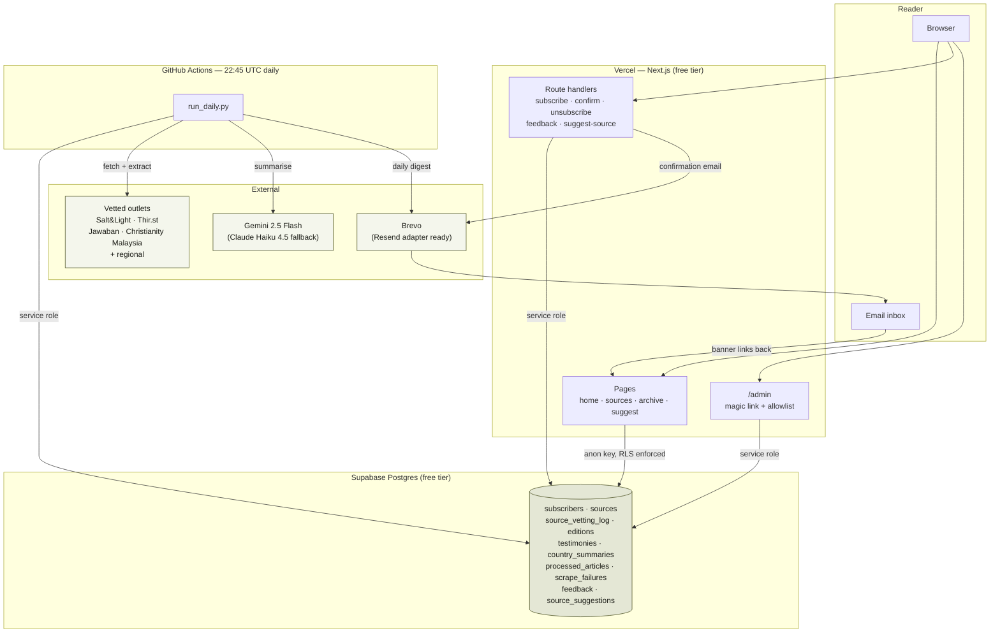
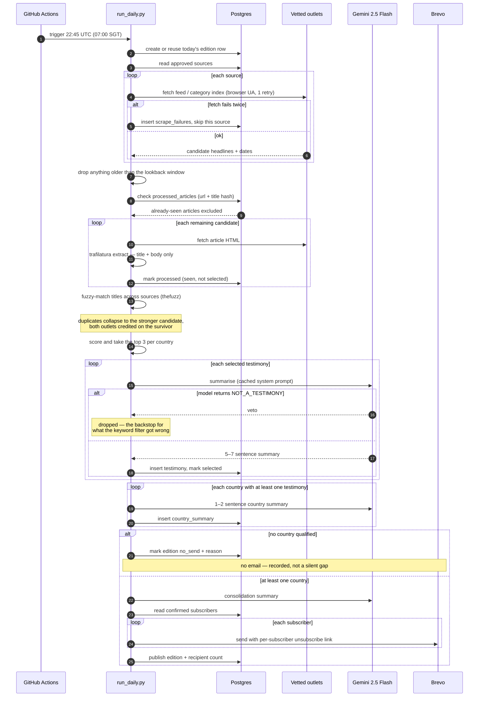
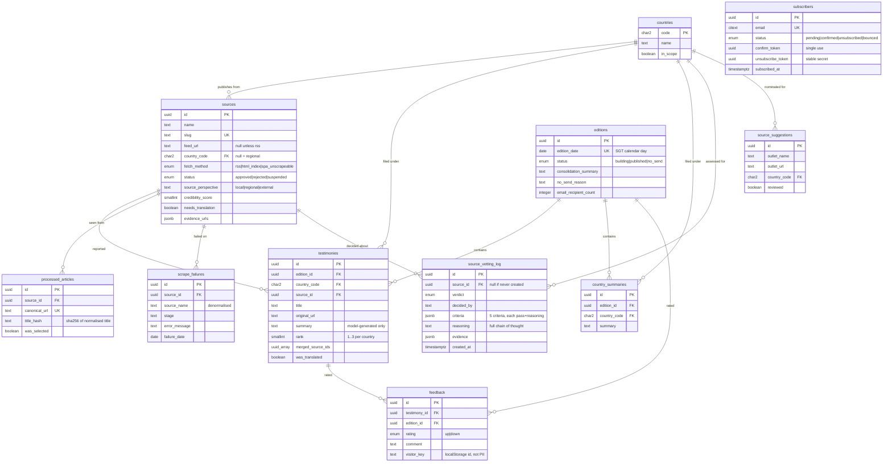
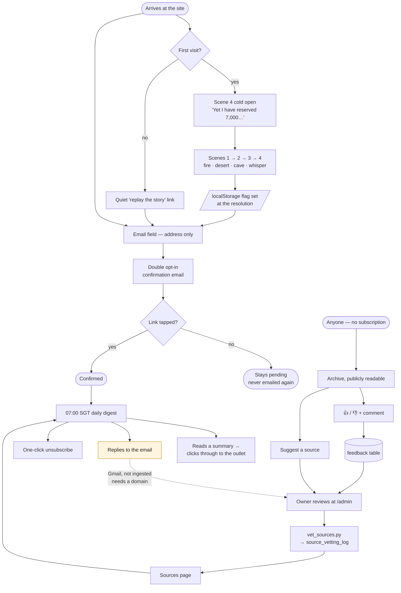

# The 7000 — architecture

Four diagrams: how the pieces fit, what the daily run actually does, what the database looks like, and how a reader moves through the product.

---

## 1. System architecture

Two independent runtimes sharing one database. The site never talks to the engine, and the engine never talks to the site — Postgres is the entire contract between them, which is why the site keeps serving the archive perfectly well on a morning when the job fails.

**Why the engine is Python and the site is TypeScript.** `trafilatura` is the best article-text extractor available and has no real JavaScript equivalent; `thefuzz` likewise for the duplicate matching. Rather than reimplement both badly, the scheduled job is Python and the web app is TypeScript. The cost is two languages in one repo. The benefit is that neither side is compromised, and GitHub Actions runs Python for free.

**Why not a Vercel Cron.** Vercel's free-tier cron is limited and the job would run inside a serverless function with an execution ceiling. A GitHub Action gets 2,000 free minutes a month, a full Python environment, and artifact upload so you can read the rendered edition after the fact.

---

## 2. The daily run, step by step

**Three things worth noticing.**

*Articles are marked processed before they are selected, not after.* An article we fetched, considered and passed over must not come back tomorrow. Otherwise a mediocre piece inside a 30-day window would be reconsidered every single day.

*The model's veto sits after selection, not before.* It costs one call on an article that gets dropped. That is the right trade: the keyword pre-filter is cheap and crude, the model is accurate and cheap enough, and shipping a persecution story rewritten in a devotional register is the one failure this product genuinely cannot afford.

*Every failure path continues.* A dead source, a failed extraction, a model error, a bad email address — each is logged and stepped over. The only thing that stops an edition is having nothing at all to send.

---

## 3. Database

**Design decisions.**

*`processed_articles` is separate from `testimonies` on purpose.* An article can be fetched, considered and rejected — and must still never be reconsidered. Deriving "have we seen this?" from `testimonies` would only remember the ones we published.

*`source_vetting_log` is append-only.* Re-vetting inserts; it never updates. Migration `0003` corrects two round-1 decisions by adding rows that cite the originals, because an audit trail you rewrite when it turns out to be wrong is not an audit trail.

*`scrape_failures.source_name` is denormalised.* If a source row is ever deleted, the failure history stays readable.

*Only summaries are stored, never source article text.* Extracted body text lives in memory for the duration of one model call and is never persisted. That is what keeps this aggregation rather than republication.

*Row-level security is on for every table.* The anon key may read published editions and approved sources, and insert into the three public write paths. It cannot read subscribers, feedback, scrape failures or the vetting log — those have RLS enabled and no policy at all, which makes them unreachable except via the service-role key.

---

## 4. Reader journey

The dotted line is the honest one: **email replies reach a human inbox but are not ingested into the feedback table.** Inbound parsing needs a custom domain. Everything else in this loop is wired.

Note also that the archive is deliberately open to anyone. It is the SEO surface and the thing a reader can forward to someone who needs it, and gating it behind a subscription would work against the entire point of the project.
